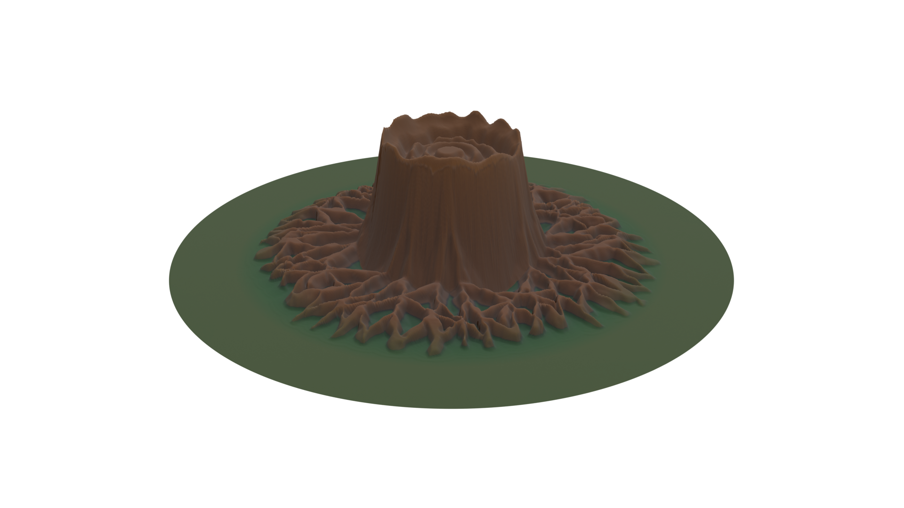
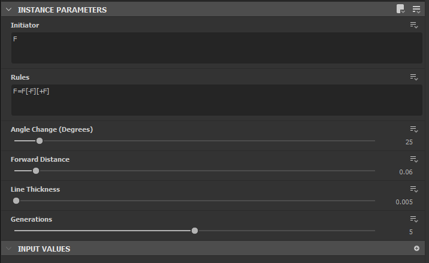
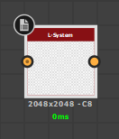
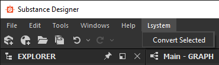
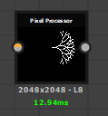

# Substance Designer L-system Plugin
### Download the [Latest Release](/releases/latest)

### Usage

1. Download and install the [latest release](/releases/latest)
1. Import [Lsystem.sbs](/Lsystem.sbs)
1. Create an L-system node and set the desired parameters  

1. Select all of the L-system nodes to be converted  

1. Click **Lsystem > Convert Selected** from the dropdown menu  

1. Use the outputted **Pixel Processor** nodes in your Substance graph  

